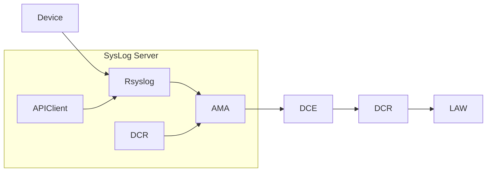

<!--
## Draft talking points - Delete before publishing

* [ ] Expensive Log Analytics Injection? Noisy syslog's?
* [x] Situation specifics (Azure, tools that didn't allow facility changes, original goals of syslog server)
* [ ] Learn Syslog Facilities (I still haven't enough)
* [ ] Learn Azure Monitoring DCR Transformations
* [ ] Learn how your syslog tool process configurations, eg `/etc/rsyslog.d/*.conf`
* [x] MS's Rsyslog configuration gets slightly better after AMA Version 1.28
* [x] It still sends too much noise. How to see how much???
* [ ] Solutions are:
  * [ ] Modify the `/etc/rsyslog.d/10-azuremonitoragent-omfwd.conf` AND/OR
  * [x] Use DCR Transformation
-->

## TL;DR

Getting CEF Messages into Azure Sentinel is more of a pain than it should be.\
You can easily send far more than you intended and then you're paying for increased ingestion & storage you didn't mean to.\
There are some queries to determine how big the problem is.\
We try to filter out the noise *getting stored* by implementing a simple Azure Monitor Data Collection Rule Transformation. This seems to have worked.\
We try to filter out the noise *getting sent in the first place* by modifying the rsyslog ruleset to reduce what gets sent to the Azure Monitoring Agent. So far the modified rsyslog config **hasn't** worked. \
We cover some methods to monitor / test if they work.\
The concept could be adapted to other situations.

## Introduction

So you've got CEF Messages you want to go into Azure Sentinel. That sounds like a neat idea doesn't it! BULLSHIT.

When reviewing a setup to get CEF messages into Sentinel, I found there was far more messages going in than their should be and that most of those messages were not valid. That sounds like $$$ going down the drain. So I went over the setup from top to bottom.

Thats where this came from. Hopefully it will help someone.

> [!NOTE] "SYSLOG, I say no, no, no!"
> In **this** scenario i'm **not** sending SYSLOG messages into Sentinel. That can be done but wasn't the point of this post. However some of the steps and/or thinking may still be useful.

<!--- cSpell:disable --->
* [TL;DR](#tldr)
* [Introduction](#introduction)
* [Overview and Scenario](#overview-and-scenario)
* [Syslog Noise](#syslog-noise)
* [DCR Transformation](#dcr-transformation)
  * [Editing DCRs](#editing-dcrs)
  * [How can I check the DCR Transformation?](#how-can-i-check-the-dcr-transformation)
  * [Is this really a fix?](#is-this-really-a-fix)
* [Rsyslog conf modification](#rsyslog-conf-modification)
  * [How can I check the new Rsyslog config working?](#how-can-i-check-the-new-rsyslog-config-working)
* [Summary](#summary)
* [References](#references)
<!--- cSpell:enable --->

## Overview and Scenario
<!-- markdownlint-disable MD051-->
In this scenario we had a [NGFW](## "Next-Generation Firewall") in an private network and a [NGAV/EDR](## "Next-Generation Antivirus/Endpoint Detection and Response") SaaS solution configured to send message to a new Ubuntu based syslog server we created running rsyslog and using [AMA](## "Azure Monitoring Agent") for Linux 1.33 (more importantly above 1.28). We then have a Azure Monitor Data Collection Rule getting syslog messages with a facility of USER/LOG_USER into the Log Analytics Workspace that is used by Sentinel. Thats a mouthful of crap. Lets break it down.
<!-- markdownlint-enable MD051-->

1. The NGFW can send CEF messages to a Syslog server and to a specific facility over a private network.
2. The NGAV/EDR solution has a Firehose API Client that routes messages to a syslog server (without facility control).
3. The syslog server is an Ubuntu 22 LTS server in Azure, running rsyslog and AMA.
4. The version of AMA matters as versions 1.28 and greater simplify the 'pickup' process. Earlier versions had different agents and methods, including unix sockets and the (now legacy) Log Analytics Agent and all sorts of other crap. Don't get me wrong AMA isn't great but its better than what we had.
5. AMA includes an rsyslog configuration that routes a copy of *all* syslog messages to the AMA.
6. An Azure Monitor Data Collection Rule (DCR) was created by Azure Sentinel that collects everything sent to USER/LOG_USER. That DCR gets deployed to the syslog server via AMA.
7. The DCR then routes the syslog messages it collects to the public Data Collection Endpoint (DCE).
8. The DCE processes the other part of the DCR which is its destination. Since this DCR was created by sentinel, its going to the same workspace sentinel is running in.

Device --> Rsyslog --> AMA --> DCE --> DCR --> LAW\
API Client --> Rsyslog --> AMA --> DCE --> DCR --> LAW



Until I get the above reding on github pages you can view the above [here](https://github.com/tlourey/tlourey.github.io/blob/main/_posts/2025-01-18-ms-sentinel-syslog-and-cef.md#overview-and-scenario)

* [ ] TODO:Get mermaid displaying correctly on github pages

There were dreams of having this one syslog server being used for everything by including some other rsyslog configs for log management but that was scaled back to focus on noise reduction and until we can refine the rsyslog configs.

> [!NOTE] Data Collection Endpoint
> I mention Data Collection Endpoint's (DCE) above. Mostly to be aware of the component. You can create Data Collections Endpoints but you don't need to unless you're using Azure Private Links.

Now we have syslog messages going into our Log Analytics Workspace and there is a lot, and I think a fair bit of it is noise.

## Syslog Noise

> [!NOTE] No SYSLOG for Sentinel
> In **this** scenario i'm **not** sending SYSLOG messages into Sentinel. That can be done but wasn't the point of this post.

Here is how I started to determine the level of noise. `DeviceVendor` is part of the [CEF standard](../pages/misc-references.md#cef). So try this KQL Query in the Log Analytics Workspace and adjust your time period/limit per your logging load (Start small then increase either the limit or the time range to get an idea):

```kql
CommonSecurityLog
| summarize Count=count() by DeviceVendor
```

Messages where the `DeviceVendor` is blank is syslog noise (Noise may be unfair but in this scenario they shouldn't be there as we are not sending regular SYSLOG messages to Sentinel. So they are not CEF messages). Also note that those that know syslog facilities better than me may not have chosen the USER facility. I didn't have a choice given the Firehose API client. Maybe I could roll my own client? ARE YOU HIGH? Anyway back on topic...

Where is the noise coming from? I had to muck around with syslog configs to get an idea. But here are some examples I found:

* 2 separate ones for MS Defender for Endpoint in Azure
* Azure Monitor Agent
* I can't remember the 3rd

So we need to reduce the noise. There are two approaches I came up with. DCR Transformation & Rsyslog config modification.

## DCR Transformation

MS suggest modifying the DCR with something like this:

```json
          "dataFlows": [
                    {
                        "streams": [
                            "Microsoft-CommonSecurityLog"
                        ],
                        "destinations": [
                            "DataCollectionEvent"
                        ],
                        "transformKql": "  source\n    |  where ProcessName !contains \"CEF\"\n"
                    }
          ]
```

I did steal the above from a specific example scenario but from what I could see CEF doesn't use the `ProcessName` field. So, we're using this transformation instead:

```json
          "dataFlows": [
                    {
                        "streams": [
                            "Microsoft-CommonSecurityLog"
                        ],
                        "destinations": [
                            "DataCollectionEvent"
                        ],
                        "transformKql": "  source\n    |  where isnotempty(DeviceVendor)\n"
                    }
          ]
```

Note that not all KQL is supported in Transformations. Refer to [Supported KQL features in Azure Monitor transformations](https://learn.microsoft.com/en-us/azure/azure-monitor/essentials/data-collection-transformations-kql)

### Editing DCRs

<!-- markdownlint-disable-line MD051-->Creating and editing [DCR](## "Data Collection Rules")'s usually requires hard-coding JSON and submitting it via the API.

"Cool Story Bro, but I really don't want to fuck around that much...". Me either so there is a cheat if your Transformation is simple.

1. Go to Azure Monitor in the Azure Portal
2. Go to Settings --> Data Collection Rules
3. Select your DCR that gets your syslog's/CEF messages
4. Go to Automation --> Export Template
5. Click Download to take a backup
6. Click Deploy at the top
7. Click Edit Template
8. Find the dataflow section
9. Add in your transformation in a new element. similar to the above example

### How can I check the DCR Transformation?

One thing I found is that it can be hard to check the DCR Transformation exactly . Here are some ways I found:

1. Metrics of the DCR - this method I found best as you can see Logs coming in, log errors, transformation time.
2. Workbooks on usage of the LAW, especially if its Sentinel-enabled.
3. Trying to mirror / watch / capture what the syslog server output. Too hard.
4. Try the noisy KQL query from above again (this was my litmus test).

### Is this really a fix?

Technically yes, but I understand what you mean. You're still sending a lot of data in the first place, then filtering it out. Depending on the scale, thats money somewhere.

The goal was to also use this as a single (or HA) syslog server for all needs instead of running multiples.

In my situation I got there by setting the CEF Connection via AMA for Sentinel, in which you must choose a SYSLOG facility to bring in and a level. One of my input devices I could change the facility and one I couldn't. So I may be stuck with User/Log_User Facility. But we could get 'creative' with the RSyslog config file as mentioned above. Thats the next step to try.

## Rsyslog conf modification

If you setup log forwarding via:

1. The Azure Monitoring Agent and a DCR
2. Setup the Sentinel CEF Connector and run Forwarder_AMA_installer.py

on your syslog server and you're running Azure Monitoring Agent v1.28 or newer, you will end up with `/etc/rsyslog.d/10-azuremonitoragent-omfwd.conf` being created. It looks like:

```bash
# Azure Monitor Agent configuration: forward logs to azuremonitoragent

template(name="AMA_RSYSLOG_TraditionalForwardFormat" type="string" string="<%PRI%>%TIMESTAMP% %HOSTNAME% %syslogtag%%msg:::sp-if-no-1st-sp%%msg%")
# queue.workerThreads sets the maximum worker threads, it will scale back to 0 if there is no activity
# Forwarding all events through TCP port
*.* action(type="omfwd"
template="AMA_RSYSLOG_TraditionalForwardFormat"
queue.type="LinkedList"
queue.filename="omfwd-azuremonitoragent"
queue.maxFileSize="32m"
queue.maxDiskSpace="1g"
action.resumeRetryCount="-1"
action.resumeInterval="5"
action.reportSuspension="on"
action.reportSuspensionContinuation="on"
queue.size="25000"
queue.workerThreads="100"
queue.dequeueBatchSize="2048"
queue.saveonshutdown="on"
target="127.0.0.1" Port="28330" Protocol="tcp")
```

> [!NOTE] Azure Monitoring Agent before 1.28
> Before 1.28 you will end up with 2 files in `/etc/rsyslog.d/`. This is because AMA uses a Unix Socket to get the syslog's, where after 1.28 its back to like it was in the Log Analytics Agent (something running on a port)

One option to consider is adjusting the rsyslog file. One Idea I was considering stealing was back from when they used the Log Analytics Agent with syslog forwarding:

```bash
if $rawmsg contains "CEF:" or $rawmsg contains "ASA-" then @@127.0.0.1:25226
```

So how does this merging look? Here is my attempt but note i'm not an rsyslog expert.

```bash
# Azure Monitor Agent configuration: forward logs to azuremonitoragent

template(name="AMA_RSYSLOG_TraditionalForwardFormat" type="string" string="<%PRI%>%TIMESTAMP% %HOSTNAME% %syslogtag%%msg:::sp-if-no-1st-sp%%msg%")
# queue.workerThreads sets the maximum worker threads, it will scale back to 0 if there is no activity
# Forwarding all events through TCP port
if $rawmsg contains "CEF:" or $rawmsg contains "ASA-" then {
  action(type="omfwd"
  template="AMA_RSYSLOG_TraditionalForwardFormat"
  queue.type="LinkedList"
  queue.filename="omfwd-azuremonitoragent"
  queue.maxFileSize="32m"
  queue.maxDiskSpace="1g"
  action.resumeRetryCount="-1"
  action.resumeInterval="5"
  action.reportSuspension="on"
  action.reportSuspensionContinuation="on"
  queue.size="25000"
  queue.workerThreads="100"
  queue.dequeueBatchSize="2048"
  queue.saveonshutdown="on"
  target="127.0.0.1" Port="28330" Protocol="tcp")
}
```

Things you may need to consider with the above script.

* The Azure support tools may not work correctly.
* Forwarder_AMA_installer.py may revert it back
* Sentinel_AMA_troubleshoot.py may not work

### How can I check the new Rsyslog config working?

Using the same Azure Metrics I used for the DCR, I should have seen a drop, but there wasn't anything noticeable one since the DCR Transformation drop. Especially given what I was seeing before the DCR Transformation. The metric of log rows dropped is still high. As such I may need to disable the translate to see how good/bad the rsyslog changes are.

## Summary

So we haven't worked out the syslog part (yet) but we're making progress. Some reading indicates that Syslog-NG may be able to modify messages before being processed which may be a better way to attack the problem but I haven't looked into that yet.

Some of the problem may be the choice of USER/LOG_USER facility level (where I had the choice) and a lack of common usages or lack of understanding the intent of specific facility levels. I get the *feeling* USER/LOG_USER is a dumping ground. My goal of just ignoring the facility level and only forwarding CEF messages should have taken care of this but the Rsyslog config didn't work.

> [!NOTE] "No SYSLOG, No Cry"
> Another reminder that in **this** scenario i'm **not** sending SYSLOG messages into Sentinel. That can be done but wasn't the point of this post. However some of the steps and/or thinking may still be useful.

Here are the takeaways:

* Use DCR KQL Transforms to reduce noise being *imported* into the LAW.
* Consider adjusting rsyslog.d conf for Azure Monitoring Agent better than I did (since my attempt is not yet working).
* Learn SYSLOG, SYSLOG facilities (and their history & usage in your Distribution), the log files, how they work and more importantly, interact.
* Spend more time designing / planning your syslog setup and config.

## References

<https://learn.microsoft.com/en-us/azure/sentinel/cef-syslog-ama-overview?tabs=single#data-ingestion-duplication-avoidance>\
<https://learn.microsoft.com/en-us/azure/azure-monitor/essentials/data-collection-transformations-kql>\
<https://www.rsyslog.com/storing-messages-from-a-remote-system-into-a-specific-file/>\
<https://www.rsyslog.com/normalizing-cisco-asa-messages/>\
<https://www.rsyslog.com/doc/configuration/index.html>\
<https://docs.redhat.com/en/documentation/red_hat_enterprise_linux/6/html/deployment_guide/s1-basic_configuration_of_rsyslog#s2-Filters>\
<https://en.wikipedia.org/wiki/Syslog>
[KQL Queries](../pages/kql-queries.md)\
[AMA DCR LAW](../pages/ama-dcr-law.md)\
[Misc References](../pages/misc-references.md#cef)
