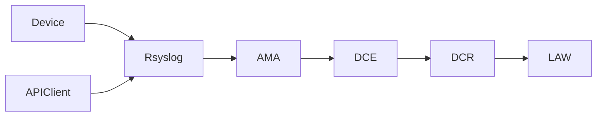
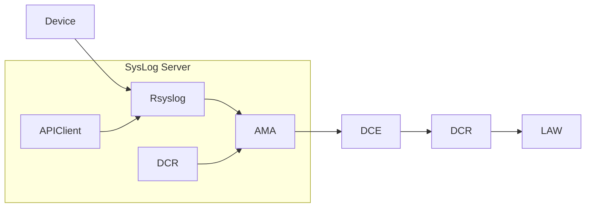

```mermaid
graph LR;
    Device --> Rsyslog;
    APIClient --> Rsyslog;
    Rsyslog --> AMA;
    AMA --> DCE;
    DCE --> DCR;
    DCR --> LAW;
```

```mermaid
flowchart LR
  Device --> Rsyslog;
  subgraph SysLog Server
    direction LR
    APIClient --> Rsyslog --> AMA
    DCR1[DCR] --> AMA
  end
  AMA --> DCE;
  DCE --> DCR2[DCR];
  DCR2[DCR] --> LAW;
```

> [!NOTE] Title
> My note with a title

Here is some other Text

> [!NOTE]
> Here is my note with no title
